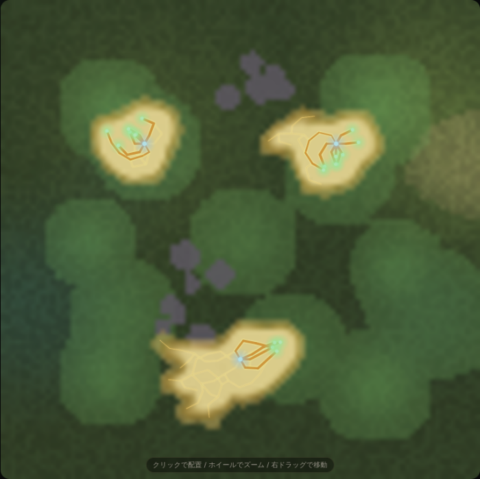
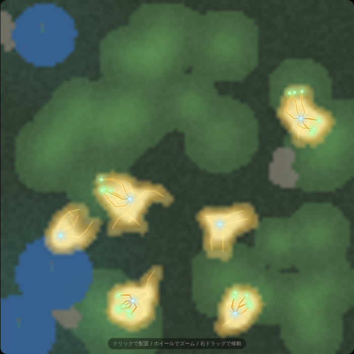

# モルフォ — 委ねて、育ついのち

粘菌 (へんもけ) の飼育シミュレーションゲーム。あなたは環境を整えるだけ。
指示はできません。あとは、いのちに委ねましょう。

▶ 遊ぶ: https://fillu87gyc.github.io/morpho/

## 遊び方

1. **環境を整える (あなた)** — エサ・光・水・障害物・温度・毒素などのツールで、
   粘菌が育つ土地を用意する。
2. **委ねる (いのちのふるまい)** — 「観察をはじめる」を押したら、あとは
   粘菌が自分の意思で伸び広がっていくのを見守るだけ。指示はできない。
3. **変化を観察する (発見と気づき)** — 一日ごとに結果を受け取り、個性・図鑑・
   系統樹の発見を楽しむ。

「見守り (連続再生)」と「デイループ (1日ずつ仕込んで委ねる)」の2つの遊び方が
あり、いつでもヘッダのボタンで切り替えられる。

## スクリーンショット




## 開発

このリポジトリは pnpm workspaces。`@morpho/sim` (粘菌のローカル則) と
`@morpho/web` (Canvas UI) の2パッケージで構成される。

```sh
pnpm install      # リポジトリルートで一度だけ
cd packages/web
pnpm dev
# → http://localhost:5173 で遊べる
```

- `pnpm test` (各パッケージ内) — vitest による純粋関数のユニットテスト
- `pnpm run test:e2e` (`packages/web`) — Playwright による e2e (要 `pnpm run build` 済みの `dist`)
- `pnpm run typecheck` — TypeScript 型検査

デプロイ: `main` ブランチへのマージで GitHub Pages へ自動デプロイされる
(`.github/workflows/pages.yml`)。

## ドキュメント

- [`ROADMAP.md`](ROADMAP.md) — 開発ロードマップ。完了済みマイルストーンの要約と、
  実プレイ検証で見つかった課題への対応。
- [`CHANGELOG.md`](CHANGELOG.md) — バージョンごとの変更履歴。
- [`docs/art-direction.md`](docs/art-direction.md) — ビジュアルの目標のルックと実装ノート。
- [`docs/QA.md`](docs/QA.md) — 実機QAのチェックリスト (iOS/Android の safe-area・PWA・ピンチ操作等)。

## コンセプト

「制御する」のではなく、「条件を整え、振る舞いを引き出す」。
答えはひとつじゃない。いのちに委ねる育成ゲーム。
